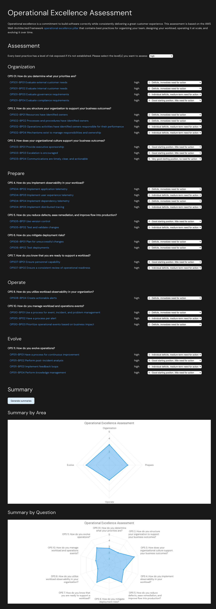

# Operational excellence assessment

[](https://github.com/lakermann/operational-excellence-assessment/actions/workflows/ci.yml)
[](https://github.com/lakermann/operational-excellence-assessment/actions/workflows/cd.yml)

_by [Lukas Akermann](https://github.com/lakermann)_

If the foundation of a software system is not solid, structural problems can compromise its integrity and functionality.
The [AWS Well-Architected Framework](https://docs.aws.amazon.com/wellarchitected/latest/framework/welcome.html),
provides a set of best practices to evaluate architectures, and provides a set of
questions to evaluate how well an architecture is aligned to best practices. The framework is based on six pillars —
operational excellence, security, reliability, performance efficiency, cost optimization, and sustainability.

To simplify the review process of
the [operational excellence pillar](https://docs.aws.amazon.com/wellarchitected/latest/framework/operational-excellence.html),
I have created an online assessment questionnaire
that includes all framework questions
and links to the detailed documentation. You can filter questions by risk level, assess each question, and then display
the result as a chart. Good luck and have fun improving your operational excellence!

* <https://lakermann.github.io/operational-excellence-assessment/>



___

## Development

Project Setup

```sh
npm install
```

Compile and Hot-Reload for Development

```sh
npm run dev
```

Type-Check, Compile and Minify for Production

```sh
npm run build
```

Lint with [ESLint](https://eslint.org/)

```sh
npm run lint
```

Format with [Prettier](https://prettier.io/)

```sh
npm run format
```
